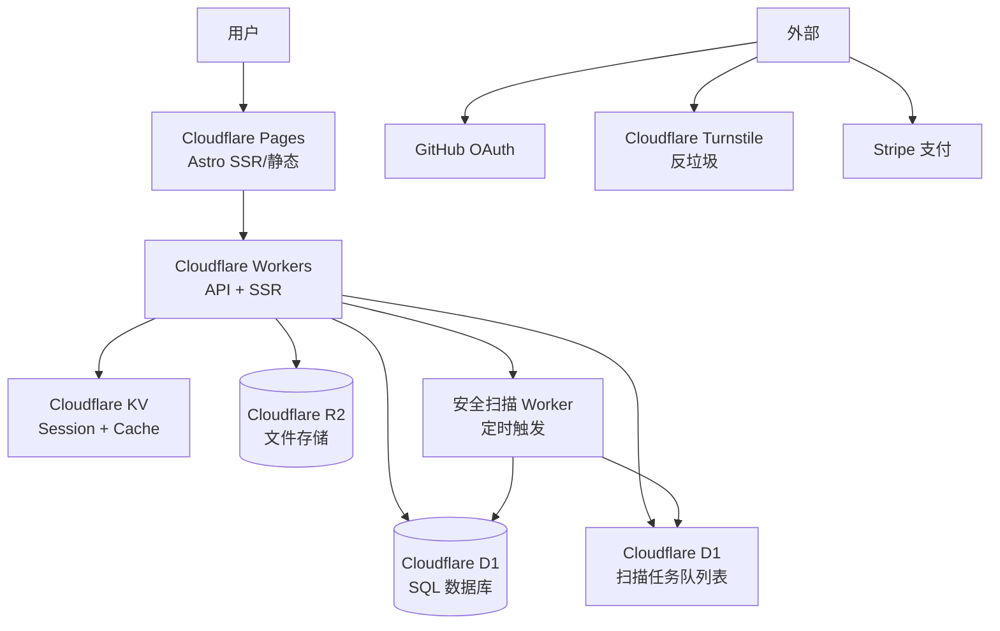
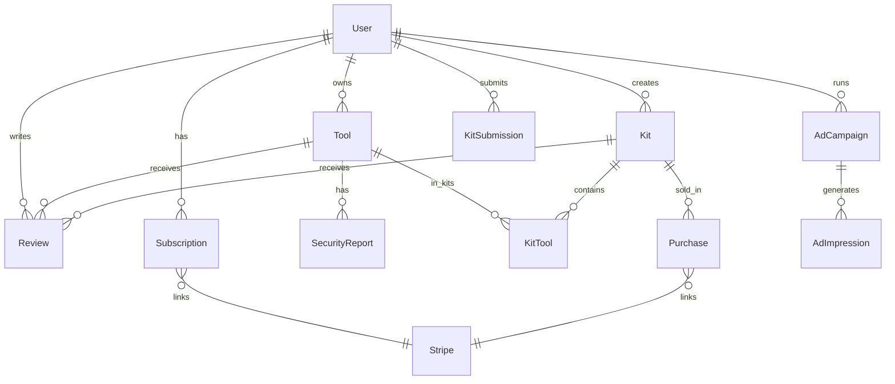

# mcpkit.run 技术设计文档 ARCH v3.0

## 1. 文档信息

- 版本：v3.0
- 作者：Arch-老K
- 对应PRD版本：v3.0
- 日期：2026-05-13
- 状态：[CONFIRMED]

---

## 2. v1.0 架构评估

### 2.1 v1.0 架构回顾

```
用户 → Cloudflare Pages → Astro 静态站点
                              ↓
                         content/
                        (Markdown)
                              ↓
                      Pagefind 搜索（内置）
```

### 2.2 v3.0 新需求对架构的冲击

| v1.0 设计 | v3.0 新需求 | 兼容性 | 结论 |
|---|---|---|---|
| 纯静态站点 | 用户认证（GitHub OAuth） | ❌ 不兼容 | 需要 Workers API |
| 无数据库 | 用户数据、Kit 配方、评论、订阅 | ❌ 不兼容 | 需要 D1 |
| 无会话管理 | 登录状态、会员权限 | ❌ 不兼容 | 需要 KV 存 Session |
| Pagefind 搜索 | 站内搜索 + Quality Score 排序 | ⚠️ 勉强可用 | 需扩展为 API 搜索 |
| 纯内容管理 | 付费推广、Kit 市场、CPC | ❌ 不兼容 | 需要支付 + 权限系统 |
| 无安全扫描 | 自动化漏洞检测 | ❌ 不兼容 | 需要异步任务系统 |

**总结：Astro + Cloudflare Pages 静态架构无法直接承载 v3.0，必须升级为"Cloudflare Pages 前端 + Cloudflare Workers API + D1/KV/R2"的混合架构。**

---

## 3. 目标架构：Cloudflare 全家桶混合架构

### 3.1 架构图



### 3.2 核心升级决策

| 决策点 | v1.0 | v3.0 | 理由 |
|---|---|---|---|
| 站点模式 | 纯静态（Static） | 混合（Hybrid SSR） | 工具/Kit 详情页需要 SSR 做 SEO |
| 前端框架 | Astro | Astro + Cloudflare SSR适配 | 复用，适配 Cloudflare Pages Workers |
| 搜索 | Pagefind | Cloudflare AI Search（免费 10k vectors） | D1 无全文搜索，需向量或 API 层 |
| 数据库 | Git Markdown | Cloudflare D1 | 关系数据，用户/Kit/评论/订阅 |
| Session | 无 | Cloudflare KV | 分布式 Session，JWT token 管理 |
| 后端逻辑 | 无 | Cloudflare Workers | API 路由、认证中间件、商业逻辑 |
| 文件存储 | Git | Cloudflare R2 | Kit 配置文件、Logo、报告 |
| 安全扫描 | 无 | Cloudflare Workers 定时任务 | Cron Trigger 免费 |
| 支付 | 无 | Stripe | 佣金/订阅收款，Stripe 有成熟 MCP 集成 |

---

## 4. Cloudflare 免费服务映射（每个新功能）

### 4.1 用户认证

**方案：Cloudflare Access（Zero Trust）+ Workers JWT**

| 组件 | 服务 | 说明 |
|---|---|---|
| GitHub OAuth | Workers 自己实现 OAuth 回调 | 免费，GitHub OAuth App 无费用 |
| JWT Session | Cloudflare KV | Token 存 KV，设置 TTL，过期自动刷新 |
| 登录保护 | Workers 中间件 | 未登录用户访问 /dashboard/* → 302 重定向 |
| Spam 保护 | Cloudflare Turnstile | 免费，无隐私问题，替代 Google reCAPTCHA |

**优点**：不需要自己的 Auth 服务（Auth.js/NextAuth），Workers 实现轻量 OAuth + JWT，完全免费。
**注意**：免费 Turnstile 无 widget 数量限制，但有每月 100 万次验证配额。

---

### 4.2 开发者控制台（认领工具/提交 Kit）

**方案：Workers API + D1 + R2**

| 功能 | 实现 |
|---|---|
| 认领工具 | 用户提交 GitHub repo → Workers 验证 ownership → D1 更新 tool.owner_id |
| 提交 Kit 配方 | 前端表单 → Workers API → D1 kit_submissions 表 → pending 状态 → 管理员审核 |
| Kit 配置预览 | 用户配置 JSON → Workers 存 R2 → 生成 shareable URL |
| 开发者主页 | Workers 读取 D1 user + tools + kits 数据，SSR 渲染 |

**数据模型扩展（D1）**：

```sql
-- 工具认领
ALTER TABLE tools ADD COLUMN owner_id TEXT REFERENCES users(id);
ALTER TABLE tools ADD COLUMN claimed_at INTEGER;

-- Kit 配方提交
CREATE TABLE kit_submissions (
  id TEXT PRIMARY KEY,
  kit_id TEXT REFERENCES kits(id),  -- null if new
  submitted_by TEXT REFERENCES users(id),
  status TEXT DEFAULT 'pending',  -- pending/approved/rejected
  submitted_at INTEGER,
  reviewed_at INTEGER,
  reviewer_id TEXT
);
```

---

### 4.3 Quality Score 体系

**方案：Workers 定时计算 + KV 缓存**

| 指标维度 | 权重 | 数据来源 |
|---|---|---|
| 社区活跃度 | 20% | D1 review count, kit集成次数 |
| 更新频率 | 20% | GitHub API 最后更新时间 |
| 安全评级 | 30% | 安全扫描结果（0=高危, 50=中危, 100=通过） |
| 用户评分 | 15% | D1 reviews 表平均分 |
| 官方认证 | 15% | certified boolean |

计算逻辑：Workers 每日 Cron 触发，计算所有工具的 Quality Score，结果存 KV（TTL 24h），API 读取 KV。

**Workers 伪代码**：
```javascript
export default {
  scheduled(controller, executionCtx) {
    const tools = await D1.database.prepare("SELECT id FROM tools").all();
    for (const tool of tools) {
      const score = await calculateQualityScore(tool.id);
      await KV.put(`qs:${tool.id}`, JSON.stringify(score), { expirationTtl: 86400 });
    }
  }
}
```

---

### 4.4 安全扫描（Phase 2）

**方案：Cloudflare Workers Cron + D1 任务队列表（Phase 2 启用）**

| 步骤 | 实现 |
|---|---|
| 扫描触发 | Workers Cron（每日一次，免费） |
| 扫描内容 | GitHub repo 安全 Advisory + npm/vuln DB 查询 |
| 结果存储 | D1 security_reports 表 |
| 扫描 Worker | 独立 Worker 函数，超时则分片执行 |
| 告警 | 发现高危 → 更新 tool.risk_level → 详情页显示 ⚠️ 标签 |

**MVP（Phase 1）不做自动扫描**，我们手工录入工具时人工检查安全性即可。自动扫描是 Phase 2 社区开放后、工具数量上来后的需求。

**D1 表结构**：
```sql
CREATE TABLE security_reports (
  id TEXT PRIMARY KEY,
  tool_id TEXT REFERENCES tools(id),
  scanned_at INTEGER,
  risk_level TEXT,  -- high/medium/low/none
  vulnerabilities TEXT,  -- JSON array
  report_url TEXT
);
```

**风险**：Workers 免费版 CPU 时间限制 10ms/请求，扫描大量 repo 可能超时。
**应对**：分批扫描（每次最多 10 个工具），使用 KV 队列做进度跟踪。

---

### 4.5 社区评分/评论

**方案：Workers API + D1**

| 功能 | 实现 |
|---|---|
| 评论发布 | POST /api/reviews → Turnstile 验证 → D1 insert |
| 评论列表 | GET /api/tools/[id]/reviews → D1 select，分页 |
| 评分聚合 | D1 AVG() 查询，存 KV 缓存 1 小时 |
| Spam 过滤 | Turnstile + 内容关键词过滤（Workers 中间件） |
| XSS 防护 | Workers 中间件转义 HTML 输出 |

**D1 表**：
```sql
CREATE TABLE reviews (
  id TEXT PRIMARY KEY,
  tool_id TEXT REFERENCES tools(id),
  kit_id TEXT,  -- nullable, either tool or kit review
  user_id TEXT REFERENCES users(id),
  rating INTEGER CHECK(rating >= 1 AND rating <= 5),
  content TEXT,
  created_at INTEGER,
  updated_at INTEGER
);
```

---

### 4.6 付费推广（CPC/置顶）

**方案：Workers API + D1 + Stripe**

| 功能 | 实现 |
|---|---|
| CPC 广告 | 工具详情页读取 D1 ad_campaigns，满足条件展示竞品广告 |
| 付费置顶 | D1 tools.promoted_until 字段，Workers 过滤时优先排序 |
| 关键词竞价 | D1 ad_bids 表存竞价，按出价排序选 top |
| 计费 | Stripe Checkout，Workers webhook 回调更新 D1 余额 |
| 免费配额 | 每月每个账户免费 1000 次广告展示 |

**D1 表**：
```sql
CREATE TABLE ad_campaigns (
  id TEXT PRIMARY KEY,
  tool_id TEXT REFERENCES tools(id),
  user_id TEXT REFERENCES users(id),
  type TEXT,  -- cpc/top
  bid_amount_cents INTEGER,
  daily_budget_cents INTEGER,
  status TEXT DEFAULT 'active',
  started_at INTEGER,
  ended_at INTEGER
);

CREATE TABLE ad_impressions (
  id TEXT PRIMARY KEY,
  campaign_id TEXT REFERENCES ad_campaigns(id),
  tool_id TEXT,
  clicked_at INTEGER,
  ip_hash TEXT  -- deduplication
);
```

**注意**：CPC 精确计费需要服务端确认点击，防作弊。D1 可做基本去重（IP hash），复杂防作弊后续扩展。

---

### 4.7 会员订阅

**方案：Stripe 订阅 + D1 + Cloudflare KV 权限标记**

| 层级 | 功能 | 价格 |
|---|---|---|
| Free | 基础搜索/浏览、提交工具、加入社区 | $0 |
| Pro | 高级筛选、Kit 效果报告、无限 API 访问、免广gao | $9.9/月 |
| Enterprise | 私有 Kit 托管、定制认证、SLA | 定制 |

**实现**：
- Stripe Checkout + Subscription Webhook → Workers 处理 → 更新 D1 users.subscription_tier
- Cloudflare KV 存 `subscription:{user_id}` 快速权限校验（TTL 1h）
- Pro 用户解锁：高级筛选 API、Kit 报告页面、无广告

**D1 表**：
```sql
CREATE TABLE subscriptions (
  id TEXT PRIMARY KEY,
  user_id TEXT UNIQUE REFERENCES users(id),
  stripe_subscription_id TEXT,
  tier TEXT DEFAULT 'free',  -- free/pro/enterprise
  status TEXT,  -- active/canceled/past_due
  current_period_end INTEGER,
  created_at INTEGER
);
```

---

### 4.8 Kit 市场（付费 Kit）

**方案：Stripe Connect + D1 + R2**

| 功能 | 实现 |
|---|---|
| 上架付费 Kit | 开发者设置价格 → D1 kit.is_paid=true, price_cents → Stripe Connect 收款 |
| 购买 Kit | Stripe Checkout → Webhook 回调 → D1 purchases 表 |
| 佣金结算 | Stripe Connect 自动分账（平台 20%，作者 80%） |
| Kit 配置下载 | 已购用户 → Workers 验证 ownership → R2 文件签名 URL |
| 免费 Kit | 保持现有逻辑，仅变更 is_paid 标志 |

**D1 表**：
```sql
CREATE TABLE kits (
  id TEXT PRIMARY KEY,
  name TEXT,
  description TEXT,
  category TEXT,
  owner_id TEXT REFERENCES users(id),
  is_paid BOOLEAN DEFAULT FALSE,
  price_cents INTEGER,
  status TEXT DEFAULT 'draft',  -- draft/pending/approved/published
  stripe_connect_account_id TEXT,  -- developer's Stripe account
  quality_score INTEGER,
  created_at INTEGER,
  updated_at INTEGER
);

CREATE TABLE purchases (
  id TEXT PRIMARY KEY,
  kit_id TEXT REFERENCES kits(id),
  buyer_id TEXT REFERENCES users(id),
  stripe_payment_intent_id TEXT,
  amount_cents INTEGER,
  platform_fee_cents INTEGER,
  status TEXT,
  purchased_at INTEGER
);
```

---

## 5. 数据模型（完整 E-R）



**核心 D1 表**：

```sql
CREATE TABLE users (
  id TEXT PRIMARY KEY,
  github_id TEXT UNIQUE,
  email TEXT,
  name TEXT,
  avatar_url TEXT,
  subscription_tier TEXT DEFAULT 'free',
  stripe_customer_id TEXT,
  created_at INTEGER
);

CREATE TABLE tools (
  id TEXT PRIMARY KEY,
  name TEXT NOT NULL,
  slug TEXT UNIQUE,
  category TEXT,
  subcategory TEXT,
  tags TEXT,  -- JSON array
  price TEXT,  -- free/freemium/paid
  website TEXT,
  logo_url TEXT,
  description TEXT,
  scenarios TEXT,  -- JSON array
  install_command TEXT,
  config_example TEXT,
  quality_score INTEGER DEFAULT 0,
  risk_level TEXT DEFAULT 'none',
  owner_id TEXT,
  promoted_until INTEGER,
  featured BOOLEAN DEFAULT FALSE,
  created_at INTEGER,
  updated_at INTEGER
);

CREATE TABLE kits (
  id TEXT PRIMARY KEY,
  name TEXT NOT NULL,
  slug TEXT UNIQUE,
  description TEXT,
  category TEXT,
  owner_id TEXT REFERENCES users(id),
  is_paid BOOLEAN DEFAULT FALSE,
  price_cents INTEGER,
  quality_score INTEGER DEFAULT 0,
  certified BOOLEAN DEFAULT FALSE,
  status TEXT DEFAULT 'pending',
  created_at INTEGER,
  updated_at INTEGER
);

CREATE TABLE kit_tools (
  kit_id TEXT REFERENCES kits(id),
  tool_id TEXT REFERENCES tools(id),
  role TEXT,  -- primary/secondary
  config_overrides TEXT,  -- JSON
  PRIMARY KEY (kit_id, tool_id)
);

CREATE TABLE reviews (
  id TEXT PRIMARY KEY,
  tool_id TEXT,
  kit_id TEXT,
  user_id TEXT REFERENCES users(id),
  rating INTEGER CHECK(rating >= 1 AND rating <= 5),
  content TEXT,
  created_at INTEGER
);

CREATE TABLE subscriptions (
  id TEXT PRIMARY KEY,
  user_id TEXT UNIQUE REFERENCES users(id),
  stripe_subscription_id TEXT,
  tier TEXT DEFAULT 'free',
  status TEXT,
  current_period_end INTEGER
);

CREATE TABLE ad_campaigns (
  id TEXT PRIMARY KEY,
  tool_id TEXT REFERENCES tools(id),
  user_id TEXT REFERENCES users(id),
  type TEXT,  -- cpc/top
  bid_amount_cents INTEGER,
  daily_budget_cents INTEGER,
  status TEXT DEFAULT 'active'
);

CREATE TABLE purchases (
  id TEXT PRIMARY KEY,
  kit_id TEXT REFERENCES kits(id),
  buyer_id TEXT REFERENCES users(id),
  stripe_payment_intent_id TEXT,
  amount_cents INTEGER,
  platform_fee_cents INTEGER,
  status TEXT,
  purchased_at INTEGER
);

CREATE TABLE security_reports (
  id TEXT PRIMARY KEY,
  tool_id TEXT REFERENCES tools(id),
  scanned_at INTEGER,
  risk_level TEXT,
  vulnerabilities TEXT
);
```

---

## 6. API 路由设计（Workers）

| 方法 | 路径 | 认证 | 描述 |
|---|---|---|---|
| GET/POST | `/api/auth/github` | ❌ | GitHub OAuth 入口/回调 |
| POST | `/api/auth/logout` | ✅ | 登出，删除 KV session |
| GET | `/api/users/me` | ✅ | 当前用户信息 |
| GET | `/api/tools` | ❌ | 工具列表（支持筛选/分页） |
| GET | `/api/tools/[slug]` | ❌ | 工具详情（含 Quality Score） |
| POST | `/api/tools/[slug]/claim` | ✅ | 认领工具（需 GitHub ownership 验证） |
| GET | `/api/kits` | ❌ | Kit 列表 |
| GET | `/api/kits/[slug]` | ❌ | Kit 详情 |
| POST | `/api/kits` | ✅ | 提交 Kit 配方 |
| PUT | `/api/kits/[slug]` | ✅ | 更新自己的 Kit |
| GET | `/api/tools/[slug]/reviews` | ❌ | 工具评论列表 |
| POST | `/api/tools/[slug]/reviews` | ✅ | 发表评论（Turnstile 验证） |
| POST | `/api/stripe/webhook` | ❌ | Stripe 支付回调 |
| GET | `/api/dashboard` | ✅ | 开发者仪表板（自己的工具/Kit/收入） |
| GET | `/api/ads/campaigns` | ✅ | 广告活动管理 |
| POST | `/api/ads/campaigns` | ✅ | 创建广告活动 |
| GET | `/api/search` | ❌ | 搜索（降级到 Pagefind + D1 过滤） |

---

## 7. 架构调整清单

### 7.1 前端改动

| 项目 | 改动 |
|---|---|
| Astro 模式 | Static → Hybrid（`output: 'hybrid'`） |
| 动态路由 | `/tools/[slug]`, `/kits/[slug]`, `/dashboard/*` → SSR |
| 认证状态 | 前端存 `HttpOnly` Cookie（Session ID），Workers 中间件校验 |
| 国际化 | Astro i18n 插件，支持 `en/` 和 `zh/` 路径 |
| 暗色/亮色 | Tailwind CSS `dark:` class + `localStorage` 主题切换 |
| 静态页面 | 首页、博客、帮助文档 → 保持静态（Pages 边缘缓存） |

### 7.2 后端改动（Workers）

| 项目 | 改动 |
|---|---|
| 入口 | `functions/_worker.js` 或 `_routes.json` 拦截动态路径 |
| 中间件 | Auth 校验中间件、Turnstile 验证中间件、Error 处理 |
| Cron 任务 | Quality Score 每日更新（Phase 1）；安全扫描 Cron（Phase 2） |
| Stripe Webhook | 独立的 `/api/stripe/webhook` Worker，验签处理 |

### 7.3 Cloudflare 资源清单

| 资源 | 免费额度 | 用途 |
|---|---|---|
| Cloudflare Workers | 100k 请求/天，10ms CPU/请求 | API + SSR |
| Cloudflare D1 | 5GB 存储，250M 行读/天 | 主数据库 |
| Cloudflare KV | 1GB 存储，1M 读+写/天 | Session + Quality Score 缓存 |
| Cloudflare R2 | 10GB 存储/月 | Kit 配置、Logo、报告文件 |
| Cloudflare Turnstile | 1M 验证/月 | 反垃圾 |
| Cloudflare Pages | 无限带宽 | 前端部署 |
| Cloudflare AI Search | 10k vectors | 搜索（备选） |
| Stripe | 免费接入，收佣 2.9%+30¢ | 支付 |

---

## 8. 性能指标

| 指标 | 目标 |
|---|---|
| 首页 LCP | < 1.5s（静态页面 + Cloudflare 边缘缓存） |
| 工具详情页 TTFB | < 200ms（Workers SSR + D1 边缘查询） |
| 搜索响应 | < 300ms（KV 缓存 Quality Score） |
| Workers CPU 时间 | < 8ms/请求（留 20% 余量） |
| D1 查询延迟 | < 50ms（P95，全球边缘读副本） |

---

## 9. 风险与应对

| 风险 | 级别 | 应对方案 |
|---|---|---|
| **Workers CPU 超时**（安全扫描大量工具） | 高 | 分批扫描（每次 10 个），KV 队列跟踪进度，扫描 Worker 独立部署 |
| **D1 写入瓶颈**（高并发评论/提交） | 中 | D1 目前免费版无限写入（生产版有限），批量 insert + Indexed 优化 |
| **Session 存在 KV 但免费额度过低** | 中 | 压缩 session 数据，JWT 只存 user_id，权限查 D1 |
| **Stripe 佣金结算复杂** | 中 | MVP 先不做分账，平台统一收款；Stripe Connect 后续接 |
| **Quality Score 计算慢** | 低 | KV 缓存 24h，每日一次 Workers Cron 即可 |
| **R2 存储费用超免费额** | 低 | MVP 上限 10GB 够用（Logo + Kit 配置），监控告警 |
| **GitHub OAuth 用户量大** | 低 | GitHub OAuth 免费无限制，Auth.js 方案成熟 |
| **SEO 需求与 SSR 性能冲突** | 中 | 关键工具/Kit 页面 SSR + Cloudflare Cache（TTL 5min），静态页面保持不变 |

---

## 10. 实施路线图（技术侧）

| 阶段 | 技术任务 | 对应功能 |
|---|---|---|
| **Phase 1** | Workers + D1 初始化；GitHub OAuth 完成；工具/Kit CRUD API | 用户登录、目录展示 |
| **Phase 1** | Astro Hybrid 模式改造；SSR 路由接入 | 工具/Kit 详情页 SSR |
| **Phase 1** | 开发者控制台（认领/提交）UI + API | 认领工具、Kit 配方提交 |
| **Phase 2** | Quality Score Workers Cron + KV | 分数展示 |
| **Phase 2** | 安全扫描 Workers Cron | 风险标签 |
| **Phase 2** | 评论/评分 API | 社区功能 |
| **Phase 2** | Stripe 订阅接入（Checkout + Webhook） | Pro 会员 |
| **Phase 3** | Stripe Connect（Kit 市场） | 付费 Kit |
| **Phase 3** | CPC/置顶广告系统 | 付费推广 |

---

## 11. v1.0 → v3.0 架构对比

| 维度 | v1.0 | v3.0 |
|---|---|---|
| 架构类型 | 纯静态 | 混合（静态 + SSR + Workers API） |
| 数据库 | Git Markdown | Cloudflare D1 + Markdown |
| 搜索 | Pagefind | D1 过滤 + Pagefind（降级） |
| 认证 | 无 | GitHub OAuth + JWT/KV |
| 支付 | 无 | Stripe |
| 存储 | Git | D1 + R2 + Git |
| 部署 | Cloudflare Pages | Cloudflare Pages + Workers |
| 维护成本 | 极低 | 中等（Workers 需监控） |

**最大变化**：从"零后端内容站"升级为"Cloudflare Workers 驱动的全栈平台"，但仍然不需要购买独立服务器。

---

*文档版本：v3.0 | 状态：[REVIEW] 待 PM 确认架构方向后，UI 和开发可并行启动*