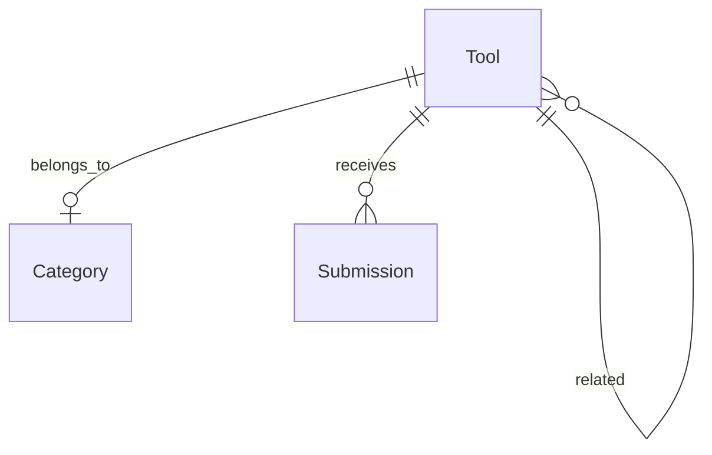

# mcpkit.run 技术设计文档

## 1. 文档信息

- 版本：v1.0
- 作者：Arch-老K
- 对应PRD版本：v1.0
- 日期：2026-05-09

---

## 2. 总体架构

### 2.1 架构定位

本项目为**内容型静态网站**，以 Astro 为核心框架，数据以结构化 Markdown/JSON 存储于 GitHub 仓库，部署至 Cloudflare Pages。无自建后端服务，MVP 阶段所有动态能力（搜索、提交）均依赖前端方案或三方服务。

### 2.2 架构图

```mermaid
graph TD
    用户 --> Cloudflare Pages --> Astro静态站点
    Astro站点 --> Pagefind索引 --> 搜索结果
    Astro站点 --> 内容数据[content/ 目录<br/>Markdown + JSON]
    用户 --> 工具提交表单 --> Formspree/Netlify Forms
    提交 --> GitHub Issues --> 管理员审核
    管理员 --> 内容更新 --> GitHub --> 自动部署 --> Cloudflare Pages
```

### 2.3 核心技术决策

| 决策点 | 选用方案 | 备选方案 | 理由 |
|---|---|---|---|
| 框架 | Astro（静态模式） | Next.js | Astro 对内容站更轻量，HTML-first 更利于 SEO，Pagefind 原生集成 |
| 搜索 | Pagefind（内置） | Algolia / Fuse.js | Pagefind 为静态索引，无需后端，叉全栈依赖 |
| 内容存储 | GitHub 仓库（content/） | Headless CMS（Strapi/Contentful） | MVP 阶段足够简单，Git 即版本控制，减少维护成本 |
| 工具提交 | Formspree 或 Netlify Forms | 自建表单 API | 零后端，邮件通知即可 |
| 部署 | Cloudflare Pages | Vercel / Netlify | 域名 mcpkit.run 已接入 Cloudflare，Pages 与 DNS 同家更简 |
| CI/CD | GitHub Actions | 无 | 自动构建 + 部署，成熟稳定 |

---

## 3. 技术栈

| 层级 | 技术 | 说明 |
|---|---|---|
| 框架 | Astro v4.x | 静态站点生成器，支持 Islands 架构 |
| UI | Tailwind CSS v3 + Astro 组件 | PRD 已确定技术栈 |
| 内容 | Markdown + JSON | 工具数据以 frontmatter YAML 存储 |
| 搜索 | Pagefind | Astro 内置静态全文搜索 |
| 提交表单 | Formspree | 免费限额足够 MVP |
| 部署 | Cloudflare Pages + GitHub Actions | |
| 域名 | Cloudflare DNS | mcpkit.run |
| 图标 | Lucide 或 Shiki | 轻量图标库 |

---

## 4. 模块划分

### 4.1 内容模块（content/）

```
content/
  mcp-servers/       # MCP Server 工具的 Markdown 文件
    mcp-sqlite.md
    mcp-github.md
    ...
  ai-tools/          # AI Coding Tools
    cursor.md
    claude-code.md
    ...
  deployment/        # 工作流 & 部署工具
    vercel.md
    supabase.md
    ...
```

每个工具文件格式（frontmatter）：

```yaml
---
title: mcp-sqlite
name: mcp-sqlite
category: mcp-server
subcategory: database
tags: [sqlite, database, local]
price: free
website: https://github.com/...
logo: /logos/mcp-sqlite.png
description: 一个轻量本地 SQLite 的 MCP Server
scenarios:
  - 本地数据库调试
  - 离线数据查询
installCommand: npm install -g @modelcontextprotocol/server-sqlite
config: |
  {
    "mcpServers": {
      "sqlite": {
        "command": "npx",
        "args": ["-y", "@modelcontextprotocol/server-sqlite"]
      }
    }
  }
relatedTools: [mcp-postgres, mcp-mongodb]
featured: false
submittedAt: 2026-05-01
---
```

### 4.2 前端模块

| 模块 | 路径 | 职责 |
|---|---|---|
| 首页 | `src/pages/index.astro` | Hero + 三大分类入口 + 编辑精选 + 最新工具 |
| 分类列表 | `src/pages/[category]/index.astro` | 筛选侧边栏 + 工具卡片列表 |
| 工具详情 | `src/pages/tools/[slug].astro` | 工具完整信息 + 相关工具 |
| 搜索 | `src/pages/search.astro` | Pagefind 搜索结果页 |
| 提交工具 | `src/pages/submit.astro` | 工具提交表单 |
| 组件库 | `src/components/` | ToolCard, CategoryFilter, HeroSection, SubmitForm |

### 4.3 数据流

```
GitHub 内容更新
    ↓
GitHub Actions 自动触发
    ↓
Astro 构建（pagefind 索引生成）
    ↓
Cloudflare Pages 部署
    ↓
用户访问静态页面 + Pagefind 搜索
```

---

## 5. 数据模型

### 5.1 核心实体

| 实体 | 存储方式 | 关键字段 |
|---|---|---|
| Tool（工具） | Markdown frontmatter | title, category, subcategory, tags, price, website, description, scenarios, config, relatedTools, featured |
| Category（分类） | JSON 配置文件 | id, name, slug, icon, description |
| Submission（提交） | GitHub Issue | 通过 Formspree 提交后创建 Issue |

### 5.2 分类配置（categories.json）

```json
[
  { "id": "mcp-server", "name": "MCP Servers", "slug": "mcp-servers", "icon": "database" },
  { "id": "ai-tool", "name": "AI Coding Tools", "slug": "ai-tools", "icon": "code-2" },
  { "id": "deployment", "name": "工作流 & 部署", "slug": "deployment", "icon": "cloud" }
]
```

### 5.3 E-R 简化模型



---

## 6. API 设计

本项目为纯静态站点，**无自建后端 API**。外部集成如下：

| 用途 | 方案 | 端点/方式 |
|---|---|---|
| 搜索 | Pagefind | `/search?q=keyword`（前端页面） |
| 工具提交 | Formspree | `POST https://formspree.io/f/xxx` |
| 新 Issue 创建 | GitHub API | `POST /repos/{owner}/{repo}/issues`（由 Formspree Webhook 触发） |

---

## 7. 页面结构

| 页面 | 路由 | 数据来源 |
|---|---|---|
| 首页 | `/` | featured tools + latest tools |
| MCP Servers 列表 | `/mcp-servers/` | 所有 mcp-servers/ 内容 |
| AI Tools 列表 | `/ai-tools/` | 所有 ai-tools/ 内容 |
| 部署工具列表 | `/deployment/` | 所有 deployment/ 内容 |
| 工具详情 | `/tools/[slug]/` | 单个 Markdown 文件 |
| 搜索结果 | `/search/` | Pagefind 索引 |
| 提交工具 | `/submit/` | Formspree 表单 |

---

## 8. 搜索方案

**Pagefind**（Astro 内置静态全文搜索）：

- 构建时生成索引文件
- 浏览器端直接搜索，无需请求服务器
- 支持中文分词（需额外配置）
- 搜索范围：标题、描述、标签、分类

**备选升级路径**：若 Pagefind 效果不满足，可平滑迁移至 Algolia DocSearch（免费计划 10k searches/mo）。

---

## 9. 安全与合规

| 措施 | 说明 |
|---|---|
| 表单防护 | Formspree 自带 Spam 过滤 + CAPTCHA |
| CSP | Cloudflare Pages 安全头配置 |
| HTTPS | Cloudflare 自动提供 |
| 第三方资源 | 使用可靠 CDN（unpkg, jsdelivr）并锁定版本 |
| 隐私 | 不收集用户数据（除提交表单邮箱字段） |

---

## 10. 性能指标

| 指标 | 目标值 |
|---|---|
| Lighthouse Performance | ≥ 90 |
| LCP（最大内容绘制） | ≤ 2.5s |
| First Contentful Paint | ≤ 1.8s |
| 页面大小（首页） | ≤ 500KB（未压缩） |
| 图片 | WebP 格式，懒加载 |
| 构建时间 | ≤ 3 分钟（Cloudflare Pages） |

---

## 11. SEO 策略

- **Meta 标签**：每个工具有独立 title/description
- **结构化数据**：JSON-LD（Tool + WebSite schema）
- **Sitemap**：Astro sitemap 插件自动生成
- **Robots.txt**：允许搜索引擎抓取
- **Open Graph**：工具详情页有预览图
- **国际化**：中文内容为主，可扩展 en/ 路径

---

## 12. 风险与备选方案

| 风险 | 级别 | 应对方案 |
|---|---|---|
| 内容管理门槛高（纯 Markdown） | 中 | 后续可引入 Decap CMS（Netlify 开源的 Git-based CMS） |
| Pagefind 中文支持弱 | 中 | 备选 Algolia；短期内用中文分词插件 |
| 官方 MCP Registry 统一生态 | 低 | PRD 已说明差异化在"精选 + 场景化"，架构不受影响 |
| 工具提交无审核机制 | 中 | MVP 阶段人工审核，Issue + 标签管理；后续可加简单审核工作流 |

---

## 13. 目录结构

```
mcpkit/
├── public/
│   ├── logos/           # 工具 Logo
│   ├── screenshots/    # 工具截图
│   └── favicon.svg
├── src/
│   ├── components/      # Astro 组件
│   │   ├── ToolCard.astro
│   │   ├── CategoryFilter.astro
│   │   ├── HeroSection.astro
│   │   ├── SubmitForm.astro
│   │   └── SearchBox.astro
│   ├── layouts/
│   │   └── BaseLayout.astro
│   ├── pages/
│   │   ├── index.astro
│   │   ├── submit.astro
│   │   ├── search.astro
│   │   ├── mcp-servers/
│   │   │   └── index.astro
│   │   ├── ai-tools/
│   │   │   └── index.astro
│   │   ├── deployment/
│   │   │   └── index.astro
│   │   └── tools/
│   │       └── [slug].astro
│   ├── content/
│   │   ├── mcp-servers/
│   │   ├── ai-tools/
│   │   └── deployment/
│   ├── styles/
│   │   └── global.css
│   └── utils/
│       └── tools.ts     # 工具函数
├── astro.config.mjs
├── tailwind.config.mjs
├── package.json
└── README.md
```

---

## 14. 内容填充计划（技术侧配合）

| 阶段 | 内容 | 技术配合 |
|---|---|---|
| 第一批 | 50 个 MCP Server | content/mcp-servers/ 填充 Markdown，featured 标签选出 3-5 个精选 |
| 第二批 | 30 个 AI Coding Tools | content/ai-tools/ 填充 |
| 第三批 | 30 个 Deployment 工具 | content/deployment/ 填充 |

---

*文档版本：v1.0 | 下一步：PM 审核 ARCH.md → 确认后启动 UI 设计*